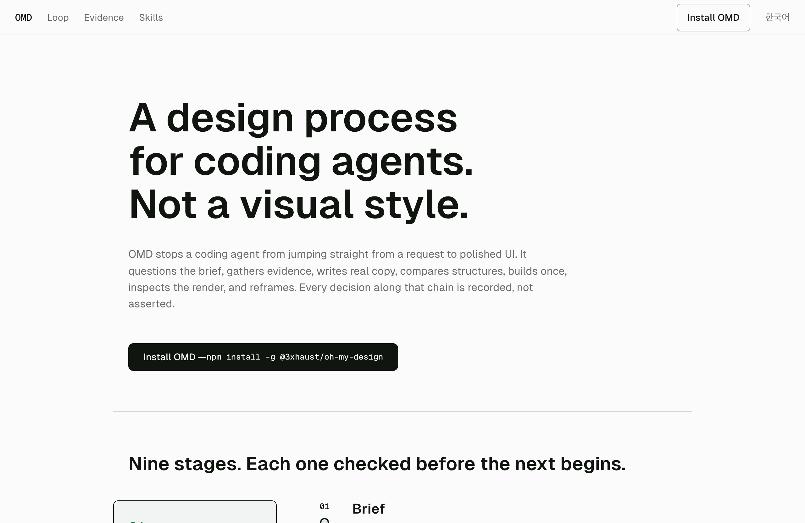

# Oh My Design

비주얼 스타일이 아니라, 코딩 에이전트를 위한 디자인 프로세스입니다. OMD는 모델이 모든 결정을 근거로 얻어내게 만듭니다. 브리프를 캐묻고, 근거를 모으고, 실제 카피를 쓰고, 타이포그래피를 증명하고, 의도적으로 구성하고, 한 번 구현하고, 렌더를 살핀 뒤 다시 정의합니다.

[English](README.md)

## OMD로 만든 결과 — 원샷 프롬프트

[](https://3x-haust.github.io/oh-my-design/)

위 랜딩 페이지는 OMD가 단일 원샷 프롬프트로 직접 생성한 결과물입니다 — 시각 출력은 손으로 다듬지 않았습니다. **[3x-haust.github.io/oh-my-design](https://3x-haust.github.io/oh-my-design/)** 에 배포되어 있으며, 소스는 [`example/`](example/) 에 있습니다.

## OMD란

여기서 ‘사람처럼 디자인한다’는 것은 특정한 결과 스타일이 아니라 근거를 남기는 판단을 뜻합니다. 목표는 반복 가능한 프로세스이며, 결과는 차분할 수도 과감할 수도 익숙하거나 낯설 수도 있습니다. 일관되는 것은 결과의 생김새가 아니라 그 뒤에 남은 결정의 흐름입니다.

Oh My Design(OMD)은 코딩 에이전트가 요청을 받자마자 완성 화면으로 뛰어드는 흐름을 막습니다. 어떤 문제를 푸는지 먼저 묻고, 근거를 기록하고, 글과 레이아웃을 분리하고, 익명 구조를 비교하고, 구현자의 의도를 모르는 리뷰어가 실제 렌더를 비평합니다.

전체 흐름은 다음과 같습니다.

```text
brief → evidence → copy → typography proof → composition contract → isolated structure → one production build
      → rendered critique and interaction evidence → reframe
```

OMD는 **Codex**와 **Claude Code** 안에서 동작합니다. 여섯 개의 사용자용 스킬, 아홉 개의 내부 파이프라인 에이전트, 로컬 `omd` CLI, 디자인 이론·레시피 팩, 그리고 `.omd/` 아래의 내구 프로젝트 기록을 제공합니다.

## 요구 사항

- **Node.js 22.18 이상** (CLI가 TypeScript 진입점을 직접 실행합니다)
- **Claude Code, Codex, 또는 둘 다** — 호스트 설정 디렉터리가 이미 존재해야 합니다
- 브라우저 공급자: 두 지원 플랫폼에서는 **browser-rs v0.1.10**을 우선 사용하고, 렌더·프로브·타이포그래피 증명을 위해 **Playwright + Chromium** 폴백을 유지합니다(아래 참고).

## 설치

### npm — 전역 CLI (권장)

```bash
npm install -g @3xhaust/oh-my-design
oh-my-design install    # 감지된 모든 호스트에 스킬+에이전트를 복사하고 설정을 패치
oh-my-design doctor     # 호스트 설치 검증
omd doctor              # 런타임, Chromium, 프로젝트 쓰기 권한, 이론 팩 검증
```

`oh-my-design install --host claude|codex` 로 install·doctor·uninstall 을 한 호스트로 한정할 수 있습니다. `uninstall` 은 `install` 이 한 일을 정확히 되돌리며, `.omd/` 디렉터리는 절대 건드리지 않습니다. 호스트 설치 뒤에는 browser-rs도 시도하고 `present`, `installed`, `unsupported`, `failed`를 보고합니다. browser-rs가 실패해도 정상 OMD/Playwright 호스트 설치를 롤백하지 않습니다.

> 반드시 **스코프** 패키지 `@3xhaust/oh-my-design` 를 설치하세요. 스코프 없는 `oh-my-design` 은 무관한 다른 프로젝트입니다.

### Claude Code — 플러그인 마켓플레이스

```text
/plugin marketplace add 3x-haust/oh-my-design
/plugin install oh-my-design@omd
```

이후 세션을 열고 `/ultradesign` 을 실행합니다.

### 소스에서 설치 (기여자)

```bash
git clone https://github.com/3x-haust/oh-my-design
cd oh-my-design
npm install
node bin/omd-install.ts install    # 감지된 호스트에 스킬+에이전트 복사
node bin/omd.ts doctor
```

### 브라우저 공급자와 Chromium (전역 설치 후)

전역으로 `@3xhaust/oh-my-design`을 설치한 뒤 OMD는 대화형 레퍼런스 조사, 사용자가 지정한 영역 캡처, 시각 QA에서 `browser-rs` MCP 공급자를 우선합니다. 이는 의도적으로 범위를 좁힌 v0.1.10 통합이며, 모든 브라우저/사이트 호환성을 주장하지 않습니다.

| 플랫폼 | browser-rs 상태 | 정확한 SHA-256 |
| --- | --- | --- |
| Darwin arm64 | 지원됨. healthy일 때 기본 대화형 공급자 | `9a5895fc2f07b1010226d30f081d678fa2edcc15dd6f24cdf10074cfe1573749` |
| Linux x64 | 지원됨. healthy일 때 기본 대화형 공급자 | `792ca76e5ce0423968763556e110900a3aa65737fc6227724914aa137e972589` |
| 그 외 모든 플랫폼 | 지원하지 않으며 browser-rs를 내려받지 않음 | 아래 Playwright + Chromium 폴백을 사용합니다. |

설치된 OMD 관리 바이너리는 `receipt.json`과 함께 `$HOME/.local/share/oh-my-design/browser-rs/v0.1.10/browser-rs`에 놓입니다. OMD는 게시 전에 정확한 체크섬을 검증합니다. 탐색 순서는 `OMD_BROWSER_RS_BIN`, `PATH`의 `browser-rs`, 그 다음 receipt로 소유권이 확인된 이 관리 대상입니다. OMD는 외부 override/PATH 바이너리나 영수증이 없거나 변조된 관리 대상 파일을 덮어쓰지 않으며, `oh-my-design browser uninstall`은 OMD 소유이고 receipt·digest가 모두 맞는 바이트만 지웁니다.

```bash
# 명시적 공급자 수명주기. 선택한 공급자가 healthy가 아니면 doctor는 1로 끝납니다.
oh-my-design browser install
oh-my-design browser doctor --json

# 전역 패키지 설치 뒤에는 같은 목적의 자체 로컬 HTML fixture를 전달합니다.
oh-my-design browser smoke --fixture /absolute/path/to/local-probe.html --out /tmp/omd-browser-rs-smoke.png

# 외부·무영수증·변조 바이트는 삭제하지 않고 보존합니다.
oh-my-design browser uninstall
```

소스 체크아웃에서는 전역 bin을 가정하지 말고 검증된 TypeScript 진입점을 사용합니다.

```bash
node bin/omd-install.ts browser install
node bin/omd-install.ts browser doctor --json
node bin/omd-install.ts browser smoke --fixture test/fixtures/probe.html --out /tmp/omd-browser-rs-smoke.png
node bin/omd-install.ts browser uninstall
```

지원 플랫폼에서 browser-rs가 없거나, 소유권이 없거나, 불량이면 unhealthy입니다. 의도한 바이너리/소유권을 먼저 복구하거나 `OMD_BROWSER_RS_BIN`을 의도적으로 설정한 뒤 `browser doctor`를 다시 실행하세요. 지원하지 않는 플랫폼에서는 Playwright 모듈과 Chromium 폴백이 모두 준비된 경우에만 공급자 상태가 healthy입니다. browser-rs 초기화/기능 실패 뒤에는 기존 `omd render`와 `omd probe`가 결정적인 Playwright 폴백입니다.

설치 프로그램은 Chromium을 설치하지 않습니다. `omd doctor` 가 Playwright 부재나 Chromium 실행 파일 누락을 보고하면, 보고된 항목을 설치한 뒤 다시 확인합니다.

```bash
npm install -g playwright
npx playwright install chromium
node bin/omd.ts doctor
```

## 채팅 우선 LEGO 레퍼런스 조립

OMD는 전체 사이트 스타일을 복제하지 않고, 확정된 브리프에 맞춰 추적 가능한 레고 부품으로 레퍼런스를 선택합니다. 표준 순서는 다음과 같습니다.

```text
brief blocks → fragment inventory → brick analysis → candidate assemblies
→ selected assembly → clean-room composite → production usage ledger → final provenance report
```

인터페이스는 대화입니다. Codex/Claude는 후보 표와 최종 한/영 출처 표를 채팅에 직접 보여 줍니다. `omd-board` 실행 파일, DESIGN UI, HTML 보드, PNG 보드는 없습니다. `reference-board-v1`은 검증된 내부 `.omd/reference-board.json` 기록일 뿐이고, 패키지의 공개 bin은 `omd`, `oh-my-design`뿐입니다.

대화 뒤에서 에이전트는 컴포넌트를 캡처하고, 근거를 검증하고, 채팅용 후보를 만들고, 사용자의 채팅 선택을 결속할 수 있습니다.

```bash
# 에이전트 내부 작업입니다. 사용자는 결과 Markdown을 채팅에서 검토합니다.
omd ref add <url-or-local-page> --as <component> --selector '<css>' --blueprint --shot
omd ref import-image ./local-fragment-input.json
omd ref check
omd ref candidates
omd ref select <candidate-id>
omd ref check
```

`omd ref candidates`는 출처 사이트/페이지, 캡처한 UI·이미지 부분, 제안 경로/컴포넌트, 가져올 점, 피할 점, 적용 방식을 담은 한국어 우선 Markdown 표를 출력합니다. 보드를 열지 않습니다. 선택은 검증된 원시 근거와 정제된 `reference-assembly-v1` 투영 양쪽의 해시에 결속됩니다.

### 캡처, 클린룸 구성, 최종 추적성

컴포넌트 부품은 selector로 범위를 정한 blueprint와 로컬 PNG입니다. Pinterest류 갤러리 및 유사 출처는 browser-rs로 **사용자가 지정한** 영역을 캡처하고 `omd ref import-image`가 그 로컬 PNG를 가져옵니다. 입력에는 절대 HTTP(S) `sourcePage`, 선택 `sourceImage`, 사람이 읽을 수 있는 `captureRegion`, 선택 `cropBox`, `licenseStatus`(`allowed`, `restricted`, `unknown`), 권리 메모, 시각 역할/원칙, 표준 provenance 시간이 기록됩니다. OMD는 원격 이미지를 스크래핑·핫링크·다운로드하거나 그 픽셀을 배포하지 않습니다.

composer는 정제된 선택 조립만 받습니다. 즉 전달 가능한 구조/원칙/geometry만 받고 출처 URL, **원본 selector**, provenance, 스크린샷, 로컬 출처 이미지, 원시 픽셀은 받지 않습니다. 구현에서 선택 부품을 목적지에 연결할 수 있도록 **대상 `targetSelector`**는 의도적으로 유지합니다. `.omd/reference-composite-lineage.json`에는 해시로 결속된 `generated` 클린룸 합성 또는 `unavailable` 이유가 기록됩니다. 호스트 이미지 생성이 가능하면 독립적인 컨셉 초안 2~3개를 병렬 생성해 비교할 수 있으며, 새 이미지 공급자나 API 키 계층은 추가하지 않습니다. 사용할 수 없으면 CSS/SVG/근거 폴백을 사용합니다. 기존 모션, `prefers-reduced-motion`, WebGL/3D 게이트는 변하지 않습니다.

구현 중에는 선택한 각 출처 부품이 `.omd/reference-usage.json`에서 `used`, `rejected`, `anti-reference` 행을 받습니다. `.omd/reference-report.md`와 최종 채팅 답변은 상태, 출처 사이트/페이지, 정확한 캡처 UI·이미지 영역, 배포 경로/컴포넌트/selector, 차용한 속성, 명시적으로 차용하지 않은 속성, 변환, 프로덕션 근거 경로·selector·검증 메모를 한/영 표로 제공합니다.

코드 근거가 있는 한/영 기능 감사, 공급자 한계, 검증 근거는 [`docs/lego-reference-audit.md`](docs/lego-reference-audit.md)를 참고하세요.

## 휴먼 디자인 루프

`omd-ultradesign` 이 다음 순서를 조율합니다.

1. **프리플라이트** — 프로젝트 디렉터리를 고정하고, `omd doctor` 를 실행하고, 저장소를 점검하고, Figma 브리프는 `omd-figma` 로 라우팅합니다.
2. **프레임** — 브리프를 캐물어 문제, 리프레임 가설, 주요 과업, 잦은 동작, 가장 비싼 오류를 근거와 함께 기록합니다.
3. **컨셉** — 생성자, 시각 레지스터, 타이포그래피 방향, 의도한 기억에 남을 순간을 정합니다.
4. **리서치** — 도메인, 경쟁자, 사용자 언어, 컴포넌트, 타이포그래피, 관련 모션에 걸쳐 측정된 레퍼런스를 모읍니다.
5. **카피 작성** — 전담 writer가 레이아웃 전에 사실 추적 가능한 카피 덱을 만듭니다.
6. **블라인드 카피 리뷰** — 새 리뷰어는 브리프·카피·사실 원장·보이스 근거만 보고, 렌더·코드·레이아웃·근거·작성자는 보지 못합니다.
7. **블라인드 타이포그래피 증명** — typesetter가 실제 카피 시편을 1280×900, 390×844에서 레이아웃 중립으로 렌더하고, 새 eye가 페이지 구조나 근거 없이 검토한 뒤 typesetter가 수정·재렌더합니다.
8. **의도적 구성** — 새 composer가 경험의 축, 하나의 지배적 초점, 매스·리듬, 합당한 메커니즘 캐리어 또는 명시적 대안, 반응형 재구성, 후보 축을 정의합니다. `omd composition --check` 가 입력 신선도를 검증합니다.
9. **구조적 발산** — 격리된 에이전트들이 동일한 컴포지션 계약을 받아 각 후보에 대해 고정 데스크톱/모바일과 보조 전체 페이지 연속성 증거를 렌더합니다.
10. **블라인드 선택** — 새 selector가 고정된 여덟 개 0–4 차원을 채점하고, 계약 위반이나 2 미만인 차원을 거부하며, 폴드 위의 폼을 CTA 도달과 동일시하지 않습니다.
11. **한 번 구현** — 선택된 하나의 구조가 프로덕션 구현이 됩니다. builder는 또 다른 후보 집합을 만들지 않습니다.
12. **구현 중 성찰** — builder가 시맨틱 체크포인트를 기록하고, 선택된 데스크톱/모바일 컨테이너에서 타입을 다시 증명한 뒤, 선택적 모션 전에 비주얼 체크포인트를 기록합니다.
13. **결과 확인** — 데스크톱·모바일 렌더, 스퀸트 뷰, 해당되는 필름스트립, 결정적 검사, 선언된 로컬 프로브가 리뷰 근거를 제공합니다.
14. **소스 후보 분류** — 프로덕션 소스가 생긴 뒤 읽기 전용 스캔이 좁은 후보를 제안합니다. 코디네이터가 렌더 맥락으로 각각을 해소하며, 후보의 존재만으로는 실패가 아닙니다.
15. **비평·수리·리프레임** — 스퀸트 전용 glance가 위계를 먼저 보고하고, 별도의 날카로운 리뷰어가 크래프트와 정제된 후보를 판단한 뒤, 수리 결과를 렌더·검사·재스캔합니다.
16. **출하** — 프로젝트 테스트, 빌드 검사, 해당 디자인 게이트, 미해소 항목을 각각의 근거와 함께 보고합니다.

Figma 파일과 명시적 시각 타깃은 이미 구조적 결정을 제공하므로, 해당 경로에서는 구조적 발산을 건너뛸 수 있지만 그 이유를 기록합니다.

## 스킬

여섯 개의 사용자용 스킬입니다. 정본 이름은 `omd-` 접두사를 쓰며, Codex는 `(omd) <스킬>` 로 표시하고, Claude 마켓플레이스 플레이버는 `oh-my-design:<스킬>` 로 참조합니다.

| 스킬 | 용도 |
| --- | --- |
| `omd-ultradesign` | 페이지, 앱, 대시보드, 블로그, 랜딩 페이지, 리디자인을 위한 전체 휴먼 디자인 루프를 실행합니다. |
| `omd-figma` | Figma 파일을 가져와 시스템을 합성하고, 프레임을 구현하고, 반응형 쌍을 비교하고, 측정된 충실도를 보고합니다. |
| `omd-scout` | 디자인·구현 없이 측정된 LEGO 조각 인벤토리와 채팅용 Markdown 후보·사용 표를 만듭니다. 할당량을 채우는 대신 결정적 커버리지 공백을 메우고 불확실성을 보고합니다. |
| `omd-critique` | 기존 디자인을 바꾸지 않고 검토합니다. 결정적 발견을 근본 원인별로 묶고 렌더된 크래프트를 판단합니다. |
| `omd-humanize` | 사실을 보존하면서 건전한 담화를 국소적으로 수리하거나, 검증된 사실·보이스·표면 동작으로부터 뒤틀린 메시지를 재구성합니다. |
| `omd-coach` | 누적된 검사 이력을 읽고 반복되는 문제와 추세를 찾아 다음에 연습할 것을 제안합니다. taste 기록은 읽지 않습니다. |

## 내부 파이프라인 에이전트

아홉 개의 에이전트는 루프의 구현 세부이며 공개 명령이 아닙니다. 구체적 모델을 고정하지 않고, 각자 세션에 선택된 모델을 상속합니다.

| 에이전트 | 책임 | 쓰기 경계 |
| --- | --- | --- |
| `omd-framer` | 브리프를 캐묻고 근거 기반 프레임을 기록합니다. | 읽기 전용. frame CLI로 기록. |
| `omd-scout` | 파이프라인 커버리지를 위한 측정 근거를 리서치합니다. | 읽기 전용. reference CLI로 기록. |
| `omd-writer` | 카피 덱과 사실 원장을 쓰거나 수리합니다. | `.omd/copy-deck.md` 만. |
| `omd-typesetter` | 구조 이전의 실제 카피 타이포그래피 증명을 만들고 수정합니다. | `.omd/type-proof.md` 와 `.omd/.cache/type-proof/`. |
| `omd-composer` | 정제된 근거를 발산 전 신선한 컴포지션 계약으로 변환합니다. | `.omd/composition.md` 만. |
| `omd-sketch` | 실제 카피가 담긴 격리된 그레이스케일 구조 후보 하나를 만듭니다. | 자신의 캐시 후보 디렉터리만. |
| `omd-hand` | 선택된 구조를 구현하고 두 개의 크래프트 체크포인트를 기록합니다. | 프로덕션 저장소와 선언된 OMD 기록. |
| `omd-glance` | 스퀸트 렌더만으로 위계를 보고합니다. | 쓰기 없음. |
| `omd-eye` | 익명 구조를 선택하거나, 카피·타이포 증명을 블라인드로 검토하거나, 날카로운 렌더를 비평합니다. | 쓰기 없음. |

Claude Code는 에이전트 메타데이터에 선언된 거부 도구를 강제할 수 있습니다. Codex 에이전트 파일에는 이에 해당하는 도구 제한 필드가 없어, 그곳의 읽기 전용 한계는 하드 샌드박스가 아니라 프롬프트 계약입니다. OMD는 이 계약을 파일시스템 격리라고 표현하지 않습니다.

## 근거 경계와 산출물

| 단계 | 내구 산출물 | 경계 |
| --- | --- | --- |
| Frame | `.omd/frame.md` | 주장은 사용자 문장, 리서치 라인, 데이터, 또는 명명된 관찰이 필요합니다. 내부 OMD 지시는 근거가 아닙니다. |
| Research | `.omd/refs/*.json` | builder는 모방할 스크린샷이 아니라 측정값과 원칙을 받습니다. 스카우팅은 보편적 캡처 수나 갤러리 할당량이 아니라 결정/컴포넌트 커버리지, 독립성, 출처 신뢰로 멈춥니다. |
| Copy | `.omd/copy-deck.md` | 출하되는 각 사실 주장은 `verified` 사실 ID를 가리킵니다. `fixture` 사실은 밀도만 테스트하고, `open` 사실은 출하 주장을 뒷받침할 수 없습니다. |
| 블라인드 카피 리뷰 | 리뷰 핸드오프 | 리뷰어는 렌더·소스·레이아웃·프레임·결정·작성자를 볼 수 없고 덱을 편집하지 않습니다. writer가 리뷰를 반영한 뒤 `omd copy --check` 를 다시 실행합니다. |
| 타이포그래피 증명 | `.omd/type-proof.md`; 시편은 `.omd/.cache/type-proof/` | 실제 대상 언어 카피가 역할, 출처/라이선스, 글리프 커버리지, 요청/계산된 패밀리·굵기, 축, 폴백/로딩, 줄바꿈/잘림, 거부된 대안을 두 뷰포트에서 증명합니다. 브라우저 증거는 각 글리프에 쓰인 물리적 폰트를 식별하지 못합니다. |
| 컴포지션 계약 | `.omd/composition.md` | 클린룸 composer가 정제된 근거를 받아 초점, CTA 경로, 메커니즘 캐리어/대안, 반응형 관계를 정의하며 폴드 위의 사진이나 폼을 요구하지 않습니다. 정확한 해시가 오래된 입력을 실패시킵니다. |
| 구조 스케치 | `.omd/.cache/sketches/<id>/` | 각 후보는 고정 1280×900, 390×844 수용 렌더와 전체 페이지 데스크톱/모바일 연속성 증거를 제공합니다. 전체 페이지 캡처는 의존성/리듬만 알려줍니다. |
| 블라인드 선택 | `.omd/taste/preferences.jsonl` | selector는 익명 렌더와 정제된 과업 맥락만 보고, 후보 근거나 작성자는 보지 못합니다. `omd choose` 가 선택된 후보와 이유를 에이전트 선택으로 저장합니다. |
| 프로덕션 빌드 | 저장소 소스 | 하나의 builder가 선택된 하나의 구조를 구현하고 카피 덱을 보존합니다. 구현 이유는 `.omd/decisions.md` 의 `omd decision` 항목으로 별도 기록됩니다. |
| 프로덕션 근거 | `.omd/attribution.md` | builder가 출하된 토큰·모션·컴포지션·그래픽의 출처를 기록합니다. |
| 크래프트 체크포인트 | `.omd/craft.jsonl` | 하나의 시맨틱과 하나의 비주얼 체크포인트가 각각 관찰과 그로 인한 구체적 변경을 기록합니다. |
| 소스 후보 분류 | 원시 JSON은 `.omd/.cache/`; 근거는 `.omd/decisions.md` | `omd slop scan` 이 소스 발췌 없이 통제된 신호를 노출합니다. `needs-render` 는 과도기이며, 최종 미분류·needs-render 수는 모두 0입니다. |
| 렌더 리뷰 | 캐시 렌더, 필름스트립, 프로브 출력 | 스퀸트 리뷰어는 스퀸트 렌더만 봅니다. 날카로운 리뷰어는 정제된 과업 맥락과 측정 출력을 받되, builder의 근거는 받지 않습니다. |
| Reframe | `.omd/frame.md` 개정 | `omd frame reframe` 는 원래 프레이밍을 지우지 않고 렌더가 드러낸 것을 덧붙입니다. |
| 최종 소스 씰 | `.omd/source-seal.json` | `omd source --seal` 은 최종 카피/타입/컴포지션과 정렬된 프로덕션 소스 해시를 기록합니다. `--check` 는 시맨틱 충실도가 아니라 바이트 신선도만 증명합니다. |

사람 승인 체크포인트는 크래프트 체크포인트와 별개입니다. 프로젝트는 기본 `checkpoint: none` 이며, `.omd/config.json` 에서 concept·structure·둘 다를 켤 수 있습니다.

## 스택 라우팅

모든 builder는 동일한 우선순위를 따릅니다.

```text
명시적 사용자 요청
  > 기존 저장소 스택과 툴체인
  > 완전한 빈 그린필드에는 React + Vite + TypeScript
```

기존 바닐라 HTML은 기존 스택입니다. 인식되지 않는 패키지나 툴체인은 조사·보존되며 빈 저장소로 취급되지 않습니다. 새 그린필드에 순수 HTML은 사용자가 명시적으로 요청할 때만 씁니다. 그린필드 스캐폴드 의존성은 허용되지만, 기존 프로젝트에는 불필요한 의존성을 추가하지 않습니다.

## 검증 스택

OMD는 결정적 검사와 렌더 리뷰를 결합합니다.

| 레이어 | 명령과 근거 |
| --- | --- |
| 계약 | `omd copy --check` 는 덱 구조와 사실 참조를 검증합니다. `omd composition --check` 는 컴포지션 섹션과 입력 신선도를 검증합니다. `omd source --seal/--check` 는 시맨틱 충실도 주장 없이 최종 승인 입력/소스 바이트를 검증합니다. `omd design --check` 는 디자인 계약 커버리지를 검증합니다. |
| 타이포그래피 증명 | 레이아웃 중립 데스크톱/모바일 시편이 스케치 전에 실행되고, 선택 컨테이너 재증명이 시맨틱 구조 이후·비주얼 체크포인트 이전에 실행됩니다. 카피, 폰트/파일, 굵기/축, 컨테이너 폭 변경이 증명을 무효화합니다. |
| 렌더 근거 | `omd render` 는 기본으로 정확한 뷰포트를 캡처합니다. `--full-page` 는 보조 연속성 근거, `--squint` 는 그레이스케일·블러로 위계를 분리, `--filmstrip` 은 로드 시점 프레임을 캡처합니다. |
| 인터랙션 | `omd probe` 는 선언된 안전한 로컬 계획만 실행하고 기대·탭 순서 실패를 보고합니다. |
| 소스 후보 | `omd slop scan [root] [--json]` 은 지원되는 프로덕션 소스를 쓰지 않고 읽습니다. 후보는 맥락적 분류가 필요하며 `omd check` 경고·점수·작성자 주장이 아닙니다. |
| 디자인 린트 | `omd check` 는 `system`, `a11y`, `slop`, `motion`, `ux` 조건을 평가합니다. 대비·터치 영역 규칙은 오류이고, slop과 기타 품질 하한 규칙은 그렇게 작성된 경우 경고입니다. 어떤 발견이든 1로 종료하므로 CI에서 쓸 수 있습니다. |
| 사이트 일관성 | `omd check --site <dir>` 또는 다중 페이지 위치 인자 검사가 페이지 간 래더·토큰 드리프트를 보고합니다. |
| 레퍼런스 거리 | `omd ref distance <page>` 가 측정 불변량을 저장된 레퍼런스와 비교해 빌드가 얼마나 가까운지 보고하는 자문(advisory) 충실도 신호입니다 — 배포를 막지 않습니다. |
| Figma 충실도 | `omd figma pull`, `system`, `diff` 가 Figma 스냅샷을 측정된 구현 보고와 연결합니다. `export FIGMA_TOKEN=…` 이 필요하며, `omd doctor` 는 토큰 부재를 선택 사항으로 처리합니다. |
| 시각 타깃 | `omd target set <이미지-경로-또는-URL> --as <name>` 과 `omd target diff` 가 등록된 PNG 타깃에 대해 경계 있는 이미지 비교를 실행합니다. URL은 직접 HTTP(S) 이미지 URL이어야 합니다. |

slop 발견은 품질 하한이자 경고이며, 디자인이 AI로 생성되었음을 증명하지 않습니다. 서면 오버룰은 의도를 기록하지만 발견을 억제하거나 명령 상태를 바꾸지 않습니다. 렌더 비평은 여전히 필요합니다 — 규칙 엔진은 광학적 균형, 컴포지션 리듬, 타이포그래피 크래프트, 또는 기억에 남을 순간이 컨셉의 것인지를 안전하게 판단할 수 없습니다.

## 인터랙션 적용성

카피 덱은 정확히 하나의 인터랙션 범위를 선언합니다.

| 범위 | 필요한 근거 |
| --- | --- |
| `stateful` | 주요·복구 카피, `.omd/probes/primary.json`, `.omd/probes/recovery.json`. 두 프로브 모두 실행됩니다. |
| `navigation-only` | 주요 카피와 주요 프로브. 복구 카피·프로브는 구체적 이유와 함께 `N/A`. |
| `static` | 주요 카피. 복구 카피와 두 프로브 모두 구체적 이유와 함께 `N/A`. |

로딩·빈·오류·성공·비활성·오프라인·복구 상태는 표면이 실제로 도달할 수 있을 때만 설계합니다 — 하네스는 체크리스트를 채우려고 가짜 상태를 더하지 않습니다. 프로브 계획은 명시적 기대가 있는 선언된 클릭·입력·키 단계를 쓰고, 로컬 파일과 localhost/loopback URL로 제한되며, 인증·원격·파괴적·미선언 동작을 거부합니다. OMD는 컨트롤을 스스로 찾아 자동으로 클릭하지 않습니다.

## 프로젝트 상태

내구적이고 검토 가능한 기록은 `.omd/` 바로 아래에 있습니다.

- `frame.md`, `copy-deck.md`, `type-proof.md`, `composition.md`, `source-seal.json`, `design.md`, `decisions.md`
- `attribution.md`, `motion-spec.md`, `craft.jsonl`, `config.json`
- `refs/*.json`, `reference-board.json`, `reference-selection.json`, `reference-composite-lineage.json`, `reference-usage.json`, `reference-report.md`, 선언된 `probes/*.json`, `taste/preferences.jsonl`, `history.jsonl`

생성된 IR, 렌더, 필름스트립, 스케치 후보, 프로브 결과, 스크래치 출력은 `.omd/.cache/` 아래에 있으며, 캐시를 지워도 디자인 의도가 사라지면 안 됩니다. `oh-my-design uninstall` 은 설치된 OMD 파일과 설정 변경을 제거하되 프로젝트의 `.omd/` 디렉터리는 보존합니다.

## CLI 레퍼런스

`node bin/omd.ts --help` 의 압축 지도입니다.

```text
omd ir <page> [-o file]
omd render <page> -o shot.png [--viewport WxH] [--full-page] [--squint] [--filmstrip]
omd probe <page> [--plan path] [--json] [--out path]
omd check [<page>|--ir file] [--json] [--category slop] [--no-log]
omd check --site <dir>
omd check <page1> <page2> ...
omd slop scan [root] [--json]
omd coach
omd composition --check [--json]
omd source --seal [root]  |  omd source --check [root] [--json]

omd frame show
omd frame set --problem P --reframe R --why EVIDENCE [--task T --frequent-action A --costliest-error E]
omd frame reframe --to "..." --because "..."
omd frame generator --set "metaphor"
omd choose c1 c2 --chose c2 --why "..."
omd decision "what" --why "why"
omd taste record "subject" --kind selection|praise|rejection|overrule --evidence "verbatim" --from-user
omd taste profile [--all]
omd config set checkpoint none|concept|structure|both  |  omd config show
omd craft checkpoint semantic|visual --render path --observed "..." --changed "..."
omd craft status [--json]

omd ref add <url|file> --as <component> [--selector "css"] [--image] [--blueprint]
omd ref list  |  omd ref distance <page>
omd ref principles <source> --as <component> --add "..."
omd ref show <source> --as <component>
omd ref check [manifest] [--json]
omd ref import-image <input.json> [--json]
omd ref candidates [manifest]                 # 채팅용 한국어 우선 Markdown, 보드 UI 없음
omd ref select <candidate-id> [--json]

omd design  |  omd design --check
omd copy --check [--json]
omd pack dir | list | <relpath>
omd doctor

omd figma pull <file-url>  |  omd figma system  |  omd figma diff <frame-id> <page-or-url>
omd target set <image-path-or-url> --as <name>  |  omd target list  |  omd target diff <page> [--target <name>] [--viewport WxH] [--threshold N] [--json]
```

## 아키텍처와 기여

프롬프트 원본:

- `src/agents/*.agent.yaml`
- `src/skills/omd-*/SKILL.md`

생성 산출물 — **직접 편집하지 마세요.** `npm run build` 가 직접 호스트와 플러그인 패키징용으로 재생성합니다:

- `agents/`, `skills/`, `dist/`

직접 편집하는 경로: `core/`, `bin/`, `adapters/`, `test/`, `evals/`, `scripts/`, `README.md`, `README.ko.md`, 그리고 `core/` 아래 이론·레시피 팩.

변경을 제출하기 전에:

```bash
npm test
npx tsc --noEmit
npm run build
```

새 린터 규칙은 좁게 유지하고, 양성·음성 테스트를 포함하며, 항상 경고 심각도를 사용합니다.

## 한계와 신뢰

- 프롬프트는 절제된 워크플로를 정의하지만, 실제 프로젝트 근거·쓸 만한 카피·렌더 검사·프로젝트별 검증 없이는 강한 디자인을 보장하지 않습니다.
- 프로브는 로컬·비인증·비파괴 경로를 위한 것이며, 범용 브라우저 자동화 계층이 아닙니다.
- 레퍼런스 거리, 린트, 이미지 diff는 측정값입니다. 판단을 대체하지 않고 정보를 줍니다.
- 플러그인/마켓플레이스 매니페스트는 배포되는 산출물이며, install→doctor 회귀 테스트가 다루는 경로는 소스 기반 직접 설치입니다.

[MIT License](LICENSE) 로 배포됩니다.
